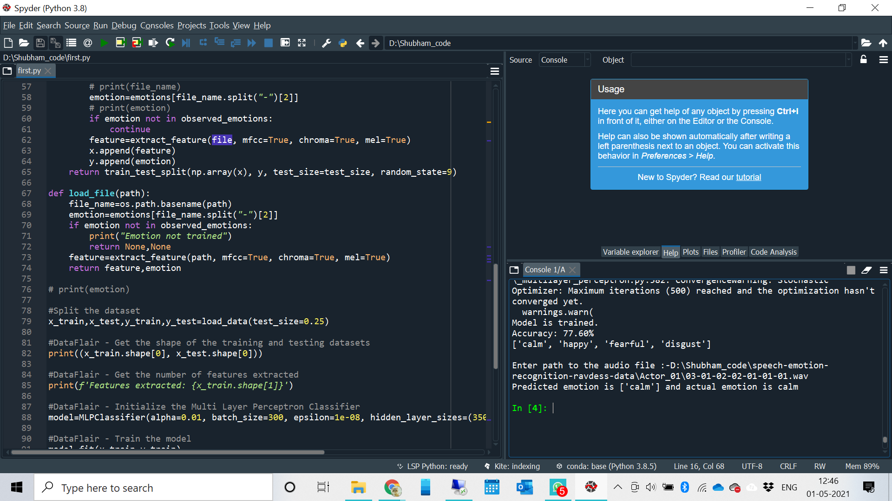

# AI Speech Emotion Recognition with librosa
 
## What is Speech Emotion Recognition?
 
 Speech Emotion Recognition, abbreviated as SER, is the act of attempting to recognize human emotion and affective states from speech. This is capitalizing on the fact that voice often reflects underlying emotion through tone and pitch. This is also the phenomenon that animals like dogs and horses employ to be able to understand human emotion.
 
<span style="display:block;text-align:center"></span>

## What is librosa?

librosa is a Python library for analyzing audio and music. It has a flatter package layout, standardizes interfaces and names, backwards compatibility, modular functions, and readable code. Further, in this Python mini-project, we demonstrate how to install it (and a few other packages) with pip.

## What is JupyterLab?

JupyterLab is an open-source, web-based UI for Project Jupyter and it has all basic functionalities of the Jupyter Notebook, like notebooks, terminals, text editors, file browsers, rich outputs, and more. However, it also provides improved support for third party extensions.

To run code in the JupyterLab, you’ll first need to run it with the command prompt:

```python
C:\Users\DataFlair>jupyter lab
```

## Speech Emotion Recognition – Objective

To build a model to recognize emotion from speech using the librosa and sklearn libraries and the RAVDESS dataset.

## Prerequisites

You’ll need to install the following libraries with pip:

```python
pip install librosa soundfile numpy sklearn pyaudio
```
If you run into issues installing librosa with pip, you can try it with conda.

## Steps for speech emotion recognition python projects

1. Make the necessary imports:

```python
import librosa
import soundfile
import os, glob, pickle
import numpy as np
from sklearn.model_selection import train_test_split
from sklearn.neural_network import MLPClassifier
from sklearn.metrics import accuracy_score
```
## Summary

In this Python mini project, we learned to recognize emotions from speech. We used an MLPClassifier for this and made use of the soundfile library to read the sound file, and the librosa library to extract features from it. As you’ll see, the model delivered an accuracy of 77.6%. That’s good enough for us yet.

Hope you enjoyed the mini python project.
